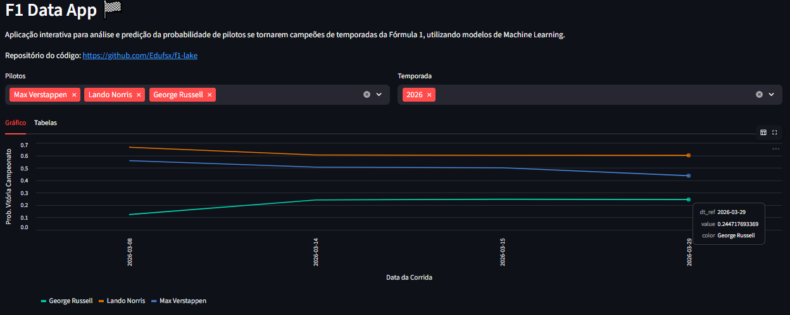
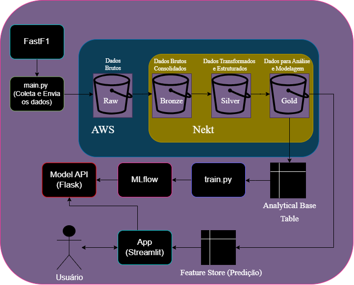
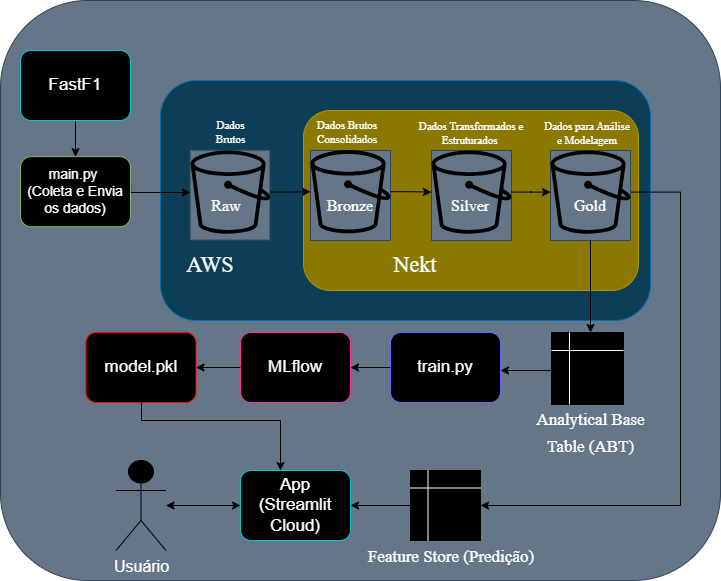

<!-- omit in toc -->
# 🏆 F1 Lakehouse & Champion Prediction

🚩 Bem-vindo ao meu projeto de **Engenharia** e **Ciência de Dados** envolvendo a Fórmula 1!



Link para a aplicação Web do projeto: [https://campeao-da-f1--by-edu.streamlit.app/](https://campeao-da-f1--by-edu.streamlit.app/).

Autor: Eduardo Ferreira da Silva.

<!-- omit in toc -->
## 🌟 Principais Destaques

- 🚣🏽‍♂️ **Pipeline** **completo** de **dados** (***Lakehouse***);
- 🤖 **Modelo** de **Machine Learning** com validação temporal;
- 💻 **API** com **Flask** + **MLflow**;
- 📈 **Aplicação** **interativa** com **Streamlit**;

<!-- omit in toc -->
## 📚 Sumário
- [🐦 Visão Geral do Projeto](#-visão-geral-do-projeto)
- [📋 Entendimento do Negócio](#-entendimento-do-negócio)
- [🔑 Definição do problema](#-definição-do-problema)
- [✍🏻 Etapas e Arquitetura do Projeto](#-etapas-e-arquitetura-do-projeto)
- [🛠️ Ferramentas Utilizadas](#️-ferramentas-utilizadas)
- [📊 Entendimento dos Dados](#-entendimento-dos-dados)
- [🌅 Data Lakehouse](#-data-lakehouse)
  - [😋 Ingestão de Dados](#-ingestão-de-dados)
  - [🥩 Camada Raw (Dados Brutos)](#-camada-raw-dados-brutos)
  - [🥉 Camada Bronze (Consolidação de Dados)](#-camada-bronze-consolidação-de-dados)
  - [🥈 Camada Silver (Transformação e Estruturação de Dados)](#-camada-silver-transformação-e-estruturação-de-dados)
  - [🥇 Camada Gold (Dados para Modelagem)](#-camada-gold-dados-para-modelagem)
- [📂 Preparação dos Dados](#-preparação-dos-dados)
  - [Feature Stores](#feature-stores)
  - [Construção da ABT](#construção-da-abt)
  - [Extração de Dados para Modelagem Local](#extração-de-dados-para-modelagem-local)
- [📀 Modelagem](#-modelagem)
  - [Sample](#sample)
  - [Explore](#explore)
  - [Modify](#modify)
  - [Model](#model)
  - [Assess](#assess)
- [🩺 Avaliação](#-avaliação)
- [🚀 Deploy](#-deploy)
  - [🔌 API de Predição (Flask + MLflow)](#-api-de-predição-flask--mlflow)
  - [🖥️ Aplicação Web (Streamlit)](#️-aplicação-web-streamlit)
- [🎫 Como Utilizar](#-como-utilizar)
  - [⚙️ Pré-requisitos](#️-pré-requisitos)
  - [▶️ Execução](#️-execução)
- [🔚 Conclusão](#-conclusão)

## 🐦 Visão Geral do Projeto

O **objetivo** deste projeto foi desenvolver uma ***Lakehouse*** e um modelo de ***Machine Learning*** (ML) capazes de organizar dados brutos da Fórmula 1 (F1) e estimar a **probabilidade** de um **piloto se tornar campeão** de uma temporada da competição, utilizando principalmente **Python** e **SQL**. 

Para o desenvolvimento da *Lakehouse*, foi utilizada a arquitetura Medalhão que organiza os dados nas camadas:
- 🥩 **Raw** (dados brutos);
- 🥉 **Bronze** (dados brutos consolidados);
- 🥈 **Silver** (dados transformados e estruturados);
- 🥇 **Gold** (dados prontos para análise e modelagem).

Já para o desenvolvimento do modelo de ML foi utilizada a metodologia *Cross-Industry Standard Process for Data Mining* (CRISP-DM) que estabelece seis etapas: 
1. **Entendimento do Negócio**;
2. **Entendimento dos Dados**;
3. **Preparação dos Dados**;
4. **Modelagem**;  
5. **Validação**;
6. **Implementação do projeto e acompanhamento**.

Além disso, dentro da etapa de modelagem utilizou-se a metodologia ***Sample-Explore-Modify-Model-Assess*** (SEMMA) desenvolvida pela empresa SAS.

## 📋 Entendimento do Negócio

A Fórmula 1 é uma competição anual composta por diversas corridas, nas quais os pilotos acumulam pontos de acordo com suas posições em cada etapa. Ao final da temporada, o piloto com maior pontuação é declarado campeão.

Nesse contexto, fatores como consistência e desempenho recente influenciam diretamente o resultado, tornando relevante a análise integrada de dados para identificar padrões e apoiar a estimativa das chances de um piloto se tornar campeão.

## 🔑 Definição do problema

Isto posto, o problema que o projeto busca resolver é: 

`Estimar, de forma quantitativa e antecipada, as chances de um piloto se tornar campeão de uma temporada de Fórmula 1 com base em dados históricos e desempenho ao longo do tempo.`

Assim, a questão norteadora a ser respondida com este projeto é:

`Qual a probabilidade de um piloto ser campeão da temporada de 2026 da Fórmula 1?`

## ✍🏻 Etapas e Arquitetura do Projeto

Para responder à pergunta do projeto, foi definida uma arquitetura composta por diferentes camadas e componentes, responsáveis pela ingestão, processamento, modelagem e disponibilização das predições. 

O fluxo criado é estruturado da seguinte forma:
1. Ingestão dos Dados;
2. Armazenamento na camada Raw;
3. Processamento na camada Bronze;
4. Tratamento na camada Silver;
5. Enriquecimento na camada Gold;
6. Treinamento do Modelo de ML;
7. Disponibilização do modelo por meio de uma API;
8. Consumo das predições por uma aplicação para o usuário.

Dessa forma, a arquitetura completa do projeto ficou assim:



Para o ambiente de deploy, optou-se por uma simplificação da arquitetura, removendo a camada de API devido aos custos de hospedagem e infraestrutura. 

Assim, a arquitetura em produção ficou definida da seguinte forma:




## 🛠️ Ferramentas Utilizadas

🔹 Para construção da *Lakehouse* e do modelo de predição de campeões da F1, foram utilizadas as seguintes tecnologias:

- 🐍 **Python**: pipeline de ingestão de dados, treinamento dos modelos de ML e desenvolvimento de aplicações para predição e visualização dos resultados;

- 🛢️ **SQL**: construção das *feature stores*, da tabela histórica de campeões da Fórmula 1 e da Tabela Base Analítica (ABT);
  
- ☁️ **AWS S3 Bucket**: armazenamento em nuvem da camada de dados brutos (*Raw*);

- 🎲 **Nekt**: orquestração da *Lakehouse*, armazenamento das camadas Bronze, Silver e Gold, integração com AWS e execução de pipelines de dados com PySpark e SQL.

- 🧺 **Docker**: containerização do ambiente para acesso à Nekt, execução de notebooks com Jupyter e download de tabelas (ABT e *fs_f1_driver_all*);

- 📒 **Jupyter**: execução interativa do código para análise exploratória.

🔹 Já as principais bibliotecas Python utilizadas foram:

- **Pandas**: manipulação e preparação dos dados;
  
- **Scikit-learn**: modelagem e avaliação dos algoritmos;

- **Feature-engine**: transformação e tratamento das *features*;

- **MLflow**: rastreamento e versionamento dos experimentos;

- **Matplotlib**: visualização de dados;

- **FastF1**: coleta de dados da Fórmula 1; 

- **Flask**: construção da API para predição;

- **Requests**: consumo da API;

- **Streamlit**: front-end para visualização de resultados.

🔹 Foram utilizados modelos baseados em árvores para classificação:

- **Random Forest**;

- **AdaBoost**.

## 📊 Entendimento dos Dados

Foram utilizados dados históricos de corridas da Fórmula 1, coletados por meio da biblioteca **FastF1** e organizados na *Lakehouse*, permitindo sua exploração, tratamento e posterior utilização na modelagem.

Os dados brutos incluem informações sobre pilotos, equipes, resultados de corridas e metadados dos eventos, tais como:

- **Pilotos**: identificadores, nome, nacionalidade e informações gerais;
- **Equipes**: nome, identificadores e cor da equipe;
- **Resultados das corridas**: posição final, grid de largada, voltas completadas, tempo de prova, status e pontuação;
- **Eventos**: ano, data, nome oficial, país e local da corrida.

## 🌅 Data Lakehouse

A ***Data Lakehouse*** deste projeto foi construída com o intuito de organizar e processar dados da Fórmula 1 de forma escalável, desde a ingestão até a preparação para a modelagem, utilizando a arquitetura medalhão.

### 😋 Ingestão de Dados

A ingestão de dados é realizada por meio de um *script* **Python** (*collect.py*), utilizando a biblioteca **FastF1**, responsável por coletar informações históricas das corridas:

```python
session = fastf1.get_session(year, gp, mode)
session._load_drivers_results()

df = session.results

# Enriquecimento
df["Year"] = session.date.year
df["Date"] = session.date
df["Mode"] = session.name
df["RoundNumber"] = session.event["RoundNumber"]
```

Cada corrida, no período de 1990 a 2026, é armazenada individualmente em arquivos no formato *parquet*.
 
Esses dados são enviados para um bucket da **AWS S3**, preservando sua estrutura original por meio de outro *script* **Python** (*sender.py*):

```python
self.s3.upload_file(
    filename, 
    self.bucket_name, 
    bucket_path
)

# Remove após upload
os.remove(filename)
```

Quando acontecem novas corridas, a atualização dos dados é feita através de um *script* que integra coleta e envio (a cada 7 dias):

```python
collect_data = CollectResults(
    years=[datetime.datetime.now().year]
)
collect_data.process_years()

sender_data = Sender(
    bucket_name=BUCKET_NAME, 
    bucket_folder=BUCKET_PATH
)
sender_data.process_folder("data/raw")
```

```python
# Aguarda 7 dias antes da próxima execução
time.sleep(60*60*24*7)
```

📄 *Scripts* utilizados:

- Coleta de dados: [data_preparation/f1_data_ingestion/collect.py](data_preparation/f1_data_ingestion/collect.py);
 
- Envio de dados: [data_preparation/f1_data_ingestion/sender.py](data_preparation/f1_data_ingestion/sender.py);

- Coleta e envio de dados: [data_preparation/f1_data_ingestion/main.py](data_preparation/f1_data_ingestion/main.py).

---

### 🥩 Camada Raw (Dados Brutos)

Os diversos arquivos em formato parquet armazenados no bucket da **AWS S3** constituem a camada **Raw** do *Data Lakehouse*. 

---

### 🥉 Camada Bronze (Consolidação de Dados)

Na sequência, a plataforma **Nekt** é utilizada para se conectar ao *bucket* da AWS S3 e processar os dados, consolidando os arquivos em formato parquet em um único *dataset*, compondo a camada **Bronze** da ***Lakehouse***. 

---

### 🥈 Camada Silver (Transformação e Estruturação de Dados)

Na camada **Silver**, a plataforma **Nekt** é utilizada para transformar os dados da camada Bronze por meio de **PySpark** e **SQL**, construindo:

- Uma *feature store* com histórico de campeões da Fórmula 1;
- Quatro *feature stores* que capturam diferentes aspectos do desempenho dos pilotos em janelas temporais baseadas em suas últimas corridas (10, 20, 40 e carreira).

---

### 🥇 Camada Gold (Dados para Modelagem)

Já na camada **Gold**, a plataforma **Nekt** é utilizada junto com **SQL** para construção da *Analytical Base Table* (ABT) e de uma *feature store* consolidada, utilizadas como base para os modelos de *Machine Learning*.

## 📂 Preparação dos Dados

Nesta etapa, foram construídas 5 *feature stores* e a ***Analytical Base Table*** (ABT), consolidando diferentes aspectos do desempenho dos pilotos ao longo do tempo e sendo armazenadas nas camadas Silver e Gold da *Data Lakehouse*.

### Feature Stores

Além da *feature store* com o histórico de campeões da Fórmula 1, foram desenvolvidas outras quatro *feature stores* de desempenho dos pilotos, baseadas em janelas temporais de suas últimas corridas:

- Últimas 10 corridas;
- Últimas 20 corridas;
- Últimas 40 corridas;
- Carreira completa (*life*).

A construção das janelas temporais utiliza uma *window function* para ranquear corridas por recência e selecionar dinamicamente as últimas N corridas por data de referência por meio do parâmetro `last_races`:

```SQL
-- Ordena rodadas da mais recente para a mais antiga
ROW_NUMBER() OVER (PARTITION BY dt_ref ORDER BY year DESC, roundnumber DESC) AS rn
```

```SQL
-- Seleciona apenas as n últimas rodadas para cada data de referência
WHERE rn <= {last_races}
```

Cada registro dessas *feature stores* representa o estado de um piloto em uma **data de referência (*dt_ref*)**, correspondente a uma corrida específica entre 1990 e 2026.

As variáveis são calculadas com base no histórico disponível até essa data, garantindo consistência temporal e evitando o uso de informações futuras.

De forma geral, as *features* podem ser agrupadas em:

- 🏁 **Desempenho em corrida**: posição média, pontuação, vitórias, pódios, top 5 e pontuação;

- ⏱️ **Desempenho em classificação**: posição média de largada, posição de largada e poles (corridas iniciadas em primeiro lugar);  

- ⛰️ **Consistência**: número de corridas finalizadas, quantidade de temporadas e participação em corridas;

- 🎯 **Eficiência**: frequência de corridas com pontuação e vezes em que largou em primeiro e ganhou a corrida; 

- 🏎️ **Dinâmica de corrida**: métricas de ultrapassagens baseada na posição inicial e final na corrida.

📄 Consultas e *scripts* utilizados:

- *Feature store* dos campeões históricos da F1: [data_preparation/processing/f1_history_champions.sql](data_preparation/processing/f1_history_champions.sql). 

- *Feature stores* de desempenho (parametrizável): [data_preparation/processing/fs_drive.sql](data_preparation/processing/fs_drive.sql).

- Pipeline para *feature store* em PySpark/SQL (executado em ambiente containerizado com acesso à Nekt): [data_preparation/processing/main.py](data_preparation/processing/main.py)

---

### Construção da ABT

A ***Analytical Base Table*** (ABT) foi construída a partir de uma ***feature store* consolidada**, que integra as variáveis das demais *feature stores* de desempenho dos pilotos em uma única base, e da criação da variável alvo, que assume valor 1 quando o piloto foi campeão na temporada de referência ou 0 caso contrário:

```SQL
-- Criação da variável alvo (campeão da temporada)
SELECT 
    t1.*,
    COALESCE(t2.rankDriver, 0) AS flChampion
FROM fs_f1_driver_all t1

LEFT JOIN f1_champions t2
ON t1.driverid = t2.driverid
AND EXTRACT(YEAR FROM t1.dt_ref) = t2.year
```

Além disso, a ABT contempla dados apenas do período de 2000 a 2025, para evitar a inclusão de dados mais antigos que podem não refletir o contexto atual da Fórmula 1 e impactar negativamente o desempenho dos modelos de *Machine Learning*.

📄 Consultas utilizadas:

- *Feature store* consolidada (*fs_f1_driver_all*): [data_preparation/processing/fs_all.sql](data_preparation/processing/fs_all.sql)

- *Analytical Base Table* (ABT): [data_preparation/processing/abt_f1_champion.sql](data_preparation/processing/abt_f1_champion.sql)

### Extração de Dados para Modelagem Local

Decidiu-se realizar a etapa de modelagem em ambiente local, devido à ausência de suporte a execução interativa na plataforma **Nekt**

Dessa forma, foi necessário realizar a extração dos dados da *Lakehouse*, incluindo a ***Analytical Base Table*** (ABT), utilizada no treinamento dos modelos, e a *feature store* consolidada (*fs_f1_driver_all*), utilizada para geração de predições.

Essa extração foi realizada por meio de um ambiente containerizado com **Docker**, utilizando **PySpark** para leitura dos dados diretamente da Nekt:

```python
# Carrega a ABT
nekt.load_table(
    layer_name="Gold",
    table_name="abt_f1_champion",
).createOrReplaceTempView("abt_f1_champion")

# Consulta da ABT para treinamento do modelo
query_abt = """
SELECT *
FROM abt_f1_champion
"""

# Executa a consulta da ABT e a transforma em DataFrame
df_abt = spark.sql(query_abt).toPandas()

# Salva a ABT em formato CSV
df_abt.to_csv("data/processed/abt_f1_drivers_champion.csv", 
          index=False,
          sep=";")
```

📄 *Script* executado em ambiente containerizado (Docker) para download de tabelas: [data_preparation/processing/download_tables.py](data_preparation/processing/download_tables.py)

## 📀 Modelagem

A etapa de modelagem foi estruturada com base na metodologia SEMMA (*Sample*, *Explore*, *Modify*, *Model* e *Assess*), garantindo organização, reprodutibilidade e consistência entre treino e inferência.

📄 O código completo desta etapa está disponível em: [ml_champion/train.py](ml_champion/train.py).

### Sample

Os dados foram divididos em três conjuntos:

- **Treino** e **Teste**: temporadas entre 2000 e 2024;
- **Out-of-Time (OOT)**: temporada de 2025.

A divisão entre treino e teste foi realizada por meio de uma amostra aleatória de temporadas por piloto, de forma estratificada pela variável alvo (*flChampion*), preservando a proporção de campeões em ambas as bases:

```python
# Base Out Of Time (OOT)
df_oot = df[df["year"] == 2025].copy()
df_analytics = df[df["year"] < 2025].copy()

# Split estratificado por target
train, test = model_selection.train_test_split(
    df_driver_year,
    random_state=42,
    train_size=0.8,
    stratify=df_driver_year["flChampion"]
)
```

Além disso, as 5 últimas corridas de cada temporada foram removidas das bases de treino e teste para evitar *data leakage*, impedindo o uso de informações futuras na previsão de eventos passados.

---

### Explore

Foi realizada uma análise exploratória focada na identificação de valores faltantes nas variáveis, avaliando sua distribuição e impacto potencial na modelagem.

Essa etapa permitiu identificar a necessidade de tratamento de *missing values* antes do treinamento dos modelos.

---

### Modify

Para tratamento de valores faltantes, foi aplicada uma estratégia de imputação utilizando um valor arbitrário (-1000), permitindo que o modelo aprenda padrões associados à ausência de informação.

Essa abordagem é especialmente útil em modelos baseados em árvores, que conseguem capturar relações não lineares e interpretar valores extremos como um sinal informativo.

---

### Model

Foram testados modelos baseados em árvores, devido à sua capacidade de capturar relações não lineares e lidar bem com dados estruturados:

- **Random Forest**
- **AdaBoost**

Os modelos foram implementados utilizando *pipelines*, unificando o pré-processamento (imputação) e o algoritmo de aprendizado:

```python
# Pipeline com imputação e Modelo   
model = pipeline.Pipeline(steps=[
    ('Imputation', missing),
    (model_name, clf)
])
```

Os hiperparâmetros foram definidos manualmente e os experimentos foram rastreados utilizando o **MLflow**, permitindo versionamento e comparação de métricas entre diferentes execuções.

---

### Assess

Os modelos foram avaliados nas bases:

- **Treino**: ajuste aos dados;
- **Teste**: generalização;
- **OOT**: desempenho em dados futuros.

O resultado obtido na comparação das bases utilizando a AUC-ROC foi o seguinte:

|     Modelo    | Treino | Teste  |  OOT   |
|---------------|--------|--------|--------|
|    AdaBoost   | 0.9753 | 0.9235 | 0.9852 |
| Random Forest | 0.9962 | 0.9885 | 0.9808 |

Pelo fato da métrica AUC-ROC estar alta, analisou-se as 3 *features* mais importantes para os modelos em busca de um possível *data leakage*.

A importância das *features* nos modelos foi a seguinte:

|     Features (AdaBoost)    | Importância (AdaBoost) | 
|----------------------------|------------------------|
| qtde_1pos_last_10          |          0.4500        |
| qtde_pole_win_last_20      |          0.1546        |
| qtde_pole_win_race_last_20 |          0.1146        |

|   Features (RandomForest)  | Importância (RandomForest) | 
|----------------------------|----------------------------|
| qtde_pole_win_last_20      |            0.0908          |
| qtde_1pos_last_10          |            0.0795          |
| qtde_1pos_race_last_20     |            0.0662          |

Análise e Escolha do Modelo:

- ☕ **AdaBoost**: Apesar da AUC-ROC elevada nas 3 bases, apresentou alta concentração de importância (0.45) na variável *qtde_1pos_last_10*, indicando forte dependência do desempenho recente e possível redução da capacidade de generalização;

- 🏞️ **Random Forest**: Apresentou desempenho consistente entre treino, teste e OOT, além de uma distribuição mais equilibrada da importância das *features*, sugerindo maior capacidade de generalização;

👉 O modelo final selecionado foi o *Random Forest*, por apresentar melhor equilíbrio entre desempenho, estabilidade e capacidade de generalização.

📄 O código completo da etapa de modelagem pode ser encontrado em: [ml_champion/train.py](ml_champion/train.py).

## 🩺 Avaliação

O modelo treinado permite estimar, de forma quantitativa e antecipada, a probabilidade de um piloto se tornar campeão, possibilitando:

- 📊 Análise comparativa entre pilotos ao longo da temporada;
- 📈 Acompanhamento da evolução de performance com base nas corridas recentes;
- 🎯 Suporte à tomada de decisão, como análises esportivas, conteúdo analítico ou aplicações interativas.

Apesar dos bons resultados, o modelo apresenta algumas limitações:

- 📉 **Dependência de padrões históricos**: mudanças nas regras ou na dinâmica da Fórmula 1 podem reduzir a capacidade preditiva;
- 🧩 **Fatores não observados**: aspectos como estratégia de equipe, clima ou falhas mecânicas não estão totalmente capturados.

## 🚀 Deploy

O deploy do projeto foi estruturado em dois cenários, com foco no consumo interativo das predições e na demonstração dos resultados:

1. 💻 **Deploy Local** (Arquitetura Completa):

Foi implementada uma arquitetura desacoplada, composta por:

  - MLflow para versionamento e gerenciamento do modelo;
  - API em Flask para disponibilização das predições;
  - Aplicação em Streamlit para consumo da API e visualização dos resultados.

Nesse cenário, o modelo é carregado dinamicamente a partir do MLflow, garantindo maior flexibilidade, reprodutibilidade e facilidade de atualização.

2. ☁️ **Deploy para demonstração** (via Streamlit Cloud):
  
  - O modelo treinado (Random Forest) foi exportado em formato .pkl no treinamento e integrado diretamente a uma aplicação web em Streamlit, hospedada na Streamlit Cloud.

Essa abordagem simplifica a arquitetura, eliminando a necessidade de uma API dedicada e reduzindo custos de infraestrutura.

### 🔌 API de Predição (Flask + MLflow)

O modelo treinado é versionado e armazenado no MLflow, sendo carregado dinamicamente na inicialização da API.

A API foi construída com Flask e possui dois *endpoints*:

- `/health_check`: utilizado para monitoramento da aplicação;
- `/predict`: responsável por receber dados e retornar a probabilidade de cada piloto ser campeão:

```python
# Garante que as features estejam alinhadas com o treinamento do modelo
X = df[MODEL.feature_names_in_]

# Gera as probabilidades de cada classe
df_proba = pd.DataFrame(MODEL.predict_proba(X), columns=MODEL.classes_)
```

Fluxo da API:

1. Carrega última versão do modelo via MLflow;
2. Recebe os dados da requisição (JSON);
3. Converte para DataFrame;
4. Seleciona as features esperadas pelo modelo;
5. Gera probabilidades com `predict_proba`;
6. Retorna o resultado em formato JSON.

### 🖥️ Aplicação Web (Streamlit)

A aplicação web foi desenvolvida em Streamlit, permitindo a visualização interativa das predições.

A principal função da aplicação é:

```python
@st.cache_resource(ttl="1d")
def get_predictions(data):
```

E dentro dessa função, vale destacar a comunicação da aplicação web com a API:

```python
# Transforma os dados no formato esperado pela API
payload = {"values": df.to_dict(orient='records')}

# Realiza requisição para o serviço de predição (Flask API)
resp = requests.post("http://localhost:5001/predict", json=payload)
resp_json = resp.json()['predictions'] 

# Extrai a probabilidade da classe '1' (1 = piloto campeão)
pred_1_map = {k: v['1'] for k, v in resp_json.items()} 

# Associa a probabilidade ao dataframe original
df = df.assign(prob_win = df["id"].map(pred_1_map))
```

Fluxo da aplicação:

1. Carrega dados da feature store;
2. Realiza pré-processamento;
3. Envia os dados para a API no *endpoint* `/predict` (deploy local) ou utiliza o modelo treinado no arquivo no formato .pkl (Streamlit Cloud);
4. Recebe as probabilidades e integra ao dataset;
5. Exibe gráficos e tabelas interativas com filtros por piloto e temporada.

## 🎫 Como Utilizar

A execução do projeto segue um fluxo sequencial, desde a ingestão de dados até a visualização das predições na aplicação web.

### ⚙️ Pré-requisitos 

Antes de iniciar, é necessário:

- Conta na **AWS S3** (armazenamento da camada Raw);
- Conta na **Nekt** (processamento e construção da *Lakehouse*);
- **Docker** instalado (para uso do Dev Container);
- **VS Code** com a extensão Dev Containers: [https://marketplace.visualstudio.com/items?itemName=ms-vscode-remote.remote-containers](https://marketplace.visualstudio.com/items?itemName=ms-vscode-remote.remote-containers);
- Arquivo `.env` configurado na raiz do projeto com as seguintes informações:

  - AWS_KEY=<sua_aws_key>
  - AWS_SECRET_KEY=<sua_aws_secret_key>
  - BUCKET_NAME=<nome_do_bucket>
  - BUCKET_PATH=<caminho_do_bucket>
  - NEKT_TOKEN=<token_de_acesso_nekt>
  - MLFLOW_URI=<endereço_servidor_mlflow>

### ▶️ Execução

> ⚠️ Todos os comandos devem ser executados a partir da raiz do projeto.

1. Coleta de Dados

Para coletar os dados de 1990 a 2026 da Fórmula 1, execute o seguinte *script*:

```bash
python data_preparation/f1_data_ingestion/collect.py --start 1990 --stop 2026 --modes R S
```

2. Envio dos dados para AWS S3

Em seguida, execute o *script* responsável pelo envio dos dados:

```bash
python data_preparation/f1_data_ingestion/sender.py
```

3. Processamento e construção das *feature stores* (Nekt)

Execute os scripts SQL/PySpark na Nekt para construção das camadas:

- Bronze
- Silver
- Gold

4. Ambiente containerizado (Dev Container)

Para realizar a extração dos dados, utilize o ambiente padronizado:

- Abra a pasta do projeto;
- Pressione `F1` ou `Ctrl + Shift + P`;
- Selecione: **Dev Containers: Reopen in Container**.

Essa etapa garante que o ambiente tenha todas as dependências e acesso configurado à Nekt.
 
5. Extração dos dados para modelagem local

No ambiente containerizado, execute o seguinte *script* para download da ABT e da *feature store* consolidada (*fs_f1_driver_all*):

```bash
python data_preparation/processing/download_tables.py
```

6. Treinamento do modelo

Inicie o servidor do `MLflow`:

```bash
mlflow server
```

Em outro terminal, execute o treinamento dos modelos:

```bash
python ml_champion/train.py
```

Após o treinamento, registre o melhor modelo no servidor do MLflow.

7. Execução da API (Flask)

Em seguida, execute o seguinte comando para subir a API:

```bash
flask --app apps.flask_api.main run --port 5001
```

8. Execução da aplicação web (Streamlit)

Na sequência, execute o seguinte comando em outro terminal:

```bash
streamlit run apps/streamlit_app_local/main.py
```

9. Atualização dos dados 

Para atualização dos dados das corridas, execute o *script* responsável por integrar coleta e envio de dados:

```bash
python data_preparation/f1_data_ingestion/main.py
```

Obs: Ele é executado a cada 7 dias.

## 🔚 Conclusão

Este projeto apresenta a construção de um *pipeline* completo de dados, desde a ingestão em uma arquitetura *Lakehouse* até o desenvolvimento de um modelo de *Machine Learning* para predição de campeões da Fórmula 1.

Ao longo do desenvolvimento, foram aplicados conceitos de Engenharia de Dados, como ingestão, transformação e modelagem em camadas (*Raw*, *Bronze*, *Silver* e *Gold*), e de Ciência de Dados, incluindo criação de *features*, validação temporal e avaliação de modelos.

A utilização de ferramentas como MLflow, Flask e Streamlit permitiu não apenas treinar e versionar modelos, mas também disponibilizar as predições de forma interativa, aproximando a solução de um cenário real de aplicação.

Por fim, o projeto evidencia a importância da integração entre engenharia e ciência de dados para construção de soluções escaláveis, reprodutíveis e orientadas a negócio, além de servir como base para evoluções futuras, como inclusão de novas variáveis, melhoria dos modelos e deploy em ambientes produtivos.